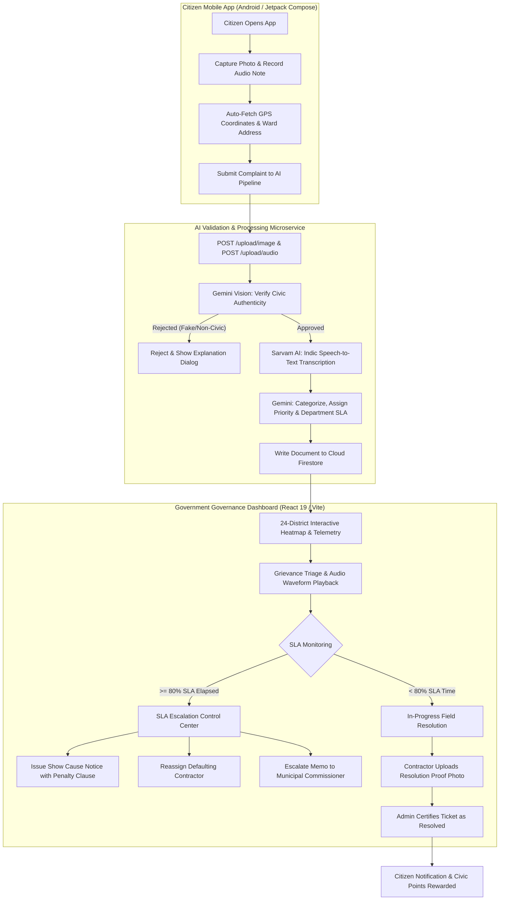
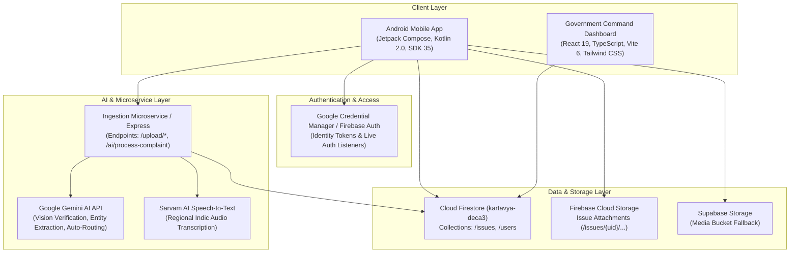

# KARTAVYA (कर्तव्य)
### Crowdsourced Civic Issue Reporting & SLA-Enforced Governance Resolution System

> **An AI-powered civic engagement and administrative governance platform empowering citizens to report hyper-localized public infrastructure grievances via voice notes and geotagged photos, while equipping state and municipal authorities with an interactive 24-district telemetry map, automated grievance triage, and an SLA escalation control center.**

---

[](LICENSE)
[-brightgreen.svg)](User%20Application)
[](Government%20Dashboard)
[](User%20Application)
[](Government%20Dashboard)
[](User%20Application/firestore.rules)
[](User%20Application/app/src/main/java/com/example/kartavya/data/SupabaseStorageRepository.kt)

---

## Overview

Public infrastructure upkeep in urban and rural municipal jurisdictions frequently breaks down due to an information disconnect:
1. **Citizens** encounter broken roads, hazardous open wires, leaking sewage, or non-functional water supplies, but face steep friction trying to file complaints through complex, text-heavy government portals in English or formal script.
2. **Municipal Administrators** struggle with unverified, duplicate, or vague complaints, lacking geospatial density analytics, real-time SLA breach alerts, and contractor accountability mechanisms.

**KARTAVYA** bridges this gap by unifying a **citizen-facing Android mobile application** with a **state-level Government Command & Triage Dashboard**.

- **For Citizens:** Snap a photo, speak naturally in your local dialect or language (Hindi / Indic dialects), and let the multi-modal AI pipeline verify authenticity, transcribe speech, determine severity, extract geolocation, and route the issue directly to the competent civic agency with an SLA timer.
- **For Government Bodies (State & Municipalities):** Monitor a high-resolution 24-district interactive vector map of Jharkhand, inspect grievance cards with waveform audio playback and bilingual transcripts, enforce Service Level Agreements (SLAs), generate formal Show Cause notices with penalty clauses, reassign defaulting contractors, and review weekly civic governance audits.

---

## Problem Statement

Civic grievance redressal systems across Indian municipalities and state departments experience acute structural bottlenecks:

| Challenge | Impact on Citizens | Administrative Pain Point |
|---|---|---|
| **Literacy & Language Barriers** | Millions of rural and semi-urban citizens cannot articulate complaints through formal written forms. | Critical infrastructure failures in marginalized wards go unreported until catastrophic collapse. |
| **Spam & Non-Verifiable Tickets** | High volumes of generic complaints without photographic proof or GPS coordinates clog grievance queues. | Field engineers waste hours dispatching inspection teams to unlocatable or invalid complaint spots. |
| **Contractor Defaulting & Zero SLA Enforcement** | Pothole or sewage tickets linger for weeks with zero accountability; contractors face no formal repercussions. | Municipal Commissioners have no live dashboard showing which ward contractor has elapsed 80%+ of their SLA window. |
| **Departmental Silos** | Roadways (PWD), Water Supply, JBVNL (Electricity), and Solid Waste pass tickets back and forth. | Citizen complaints bounce between departments, leading to low citizen trust and uncoordinated municipal governance. |

---

## Solution & Workflow

KARTAVYA implements an end-to-end, multi-tier civic reporting and resolution pipeline:



---

## Key Features

### 1. Citizen Mobile Application (Android / Kotlin)

- **Voice-First Audio Reporting (`MediaRecorder`):** Citizens record voice complaints in native Hindi or regional dialects. Sarvam AI Speech-to-Text transcribes the audio into bilingual text, eliminating literacy barriers.
- **AI-Powered Visual Authenticity Verification (`Google Gemini`):** Every uploaded photo is analyzed before ingestion. Irrelevant, abusive, or non-civic photos are rejected with clear user feedback, preventing municipal queue pollution.
- **Automated GPS & Geocoding (`LocationManager` & `Geocoder`):** Automatically pins the citizen's precise latitude, longitude, and readable street/ward address.
- **Community Feed & Real-Time Upvoting:** Local citizens browse nearby grievances and upvote critical issues. High upvote counts dynamically increase complaint urgency in the municipal triage queue.
- **Gamified Civic Rewards System:** Citizens earn civic score points and rank designations (e.g., *Newcomer*, *Active Citizen*, *Civic Guardian*) as their reported issues are validated and resolved.
- **Real-Time Lifecycle Tracking:** Citizens track their grievance through progressive stages: `Reported` → `Acknowledged` → `In Progress` → `Resolved` / `Rejected`.

### 2. Government Administration Command Center (React 19 / TypeScript)

- **Interactive 24-District SVG Vector Map:** Interactive vector map covering all 24 districts of Jharkhand (Ranchi, Dhanbad, Bokaro, Deoghar, Jamshedpur, etc.) with real-time severity clustering:
  - 🔴 **High Density / Critical Hotspot:** `> 500` issues
  - 🟠 **Medium Density:** `100 – 500` issues
  - 🟢 **Low Density / Normal:** `< 100` issues
- **Dynamic City Telemetry & Local Grievance Stream:** Real-time metrics per municipality displaying total issues, resolution percentages, top department complaints, and nodal officer contacts.
- **Granular Grievance Triage with Audio Waveform Player:**
  - Interactive audio waveform player with Hindi speech playback.
  - One-click toggle for English translations.
  - Coordinate copy tool for field engineers.
  - Full-resolution photo modal and timestamped audit trail.
- **SLA Breach & Escalation Control Center:**
  - Automated detection of tickets exceeding 80% of their SLA timeline.
  - Dispatches official **Show Cause Notices** with legally grounded penalty clauses (`₹5,000` to `₹25,000`).
  - Imposes contractor fines and reassigns stalled tickets to alternate contractors.
  - Direct memo escalation to the **Municipal Commissioner**.
- **Weekly Governance Audits & Analytics (`WeeklyReportView`):**
  - Week-by-week comparative analysis across all municipal corporations.
  - Ward-level resolution rate rankings and department performance metrics.
  - Sentiment-analyzed citizen feedback reviews and satisfaction scoring.
  - Exportable state governance summaries.
- **Field-Certified Resolution Verification (`ResolveModal`):**
  - Prevents premature ticket closure by mandating field photo evidence of the repaired site and nodal officer notes.

---

## Why This Project Is Useful

- **Eliminates Bureaucratic Inaccessibility:** By supporting voice notes and automatic GPS geolocation, any citizen—regardless of formal literacy—can report civic issues in under 30 seconds.
- **Saves Administrative Man-Hours:** Gemini AI automatically sorts complaints into specific departments (`Roadways`, `Sewage`, `Electricity`, `Waste Management`, `Water Supply`, `Street Lights`, `Public Health`), eliminating manual ticket routing.
- **Enforces Financial & Contractual Accountability:** Defaulting contractors can no longer hide behind delayed paperwork; SLA counters visually alert administrators to trigger show-cause fines before deadlines expire.
- **Fosters Community Prioritization:** Crowdsourced upvoting highlights community-critical failures (e.g., collapsed sewer lines or dangling high-tension cables) over minor issues.
- **Provides Executive Decision Support:** Senior administrators (Chief Secretary, IAS cadre, Commissioners) gain single-pane-of-glass operational visibility over all 24 districts.

---

## Visual Assets & UI Showcase

The repository contains UI design assets and real civic issue drawables:

| Asset | Location | Description |
|---|---|---|
| **Platform Branding Logo** | [Government Dashboard/resource/logo.jpeg](Government%20Dashboard/resource/logo.jpeg) | Official emblem & seal of the Kartavya governance portal. |
| **Traditional Cultural Backdrop** | [Government Dashboard/public/tribal_bg.png](Government%20Dashboard/public/tribal_bg.png) | Ambient background reflecting Jharkhand cultural art patterns. |
| **Topographical State Landscape** | [Government Dashboard/public/terrain_landscape.jpg](Government%20Dashboard/public/terrain_landscape.jpg) | High-resolution terrain mapping background. |
| **Civic Complaint Photographic Catalog** | [User Application/app/src/main/res/drawable/img_001.png](User%20Application/app/src/main/res/drawable/img_001.png) | Pothole damage, sewer line choke, exposed power cables, open transformers, and street light outages. |
| **Certified Field Resolution Evidence** | [Government Dashboard/public/issues/008-resolved.png](Government%20Dashboard/public/issues/008-resolved.png) | Verified post-repair resolution proof uploaded by field contractors. |

---

## System Architecture



---

## Technology Stack

| Layer | Technology | Purpose in Project |
|---|---|---|
| **Mobile Client** | Kotlin 2.0, Jetpack Compose, Material 3 | Modern, declarative Android citizen mobile client (Target SDK 35, Min SDK 26). |
| **Mobile Media & Async** | Coil Compose 2.7.0, Coroutines, MediaRecorder | Audio voice recording, camera image capture, and asynchronous image rendering. |
| **Mobile Identity** | Androidx Credential Manager 1.5, Google ID 1.1 | Modern one-tap Google Sign-In with Firebase Authentication integration. |
| **Web Dashboard** | React 19, TypeScript 5.8, Vite 6 | High-performance state governance command and triage dashboard. |
| **Web UI & Styling** | Tailwind CSS 4, Lucide React Icons, Canvas Confetti | Modern UI design system with warm color palettes, glassmorphism, and responsive layouts. |
| **Database & Realtime** | Google Cloud Firestore (`kartavya-deca3`) | Real-time synchronization of civic complaints (`issues`), upvotes, and citizen profiles (`users`). |
| **Storage** | Firebase Cloud Storage & Supabase Storage | Multi-provider storage for complaint photos and `.m4a` audio recordings. |
| **AI — Vision & Reasoning** | Google Gemini API (`@google/genai` 2.4.0) | Automated civic photo validation, issue severity scoring, categorization, and department routing. |
| **AI — Speech Processing** | Sarvam AI Indic STT | Transcribing native Hindi and Indian regional voice recordings into structured text. |
| **Proxy / Tunneling** | Cloudflare Tunnels (`trycloudflare.com`) | Securely exposes local development AI backends to physical Android test devices. |

---

## How It Works: Step-by-Step

1. **Citizen Onboarding:**
   - Citizen launches the Kartavya Android app and authenticates in one tap via Google Credential Manager.
   - A Firestore citizen profile is created with an initial `Newcomer` rank and 0 civic points.
2. **Grievance Capture:**
   - The citizen snaps a photo of the civic defect and holds the mic button to speak their complaint (e.g., *"हमारे वार्ड 29 में सीवर का पानी सड़क पर बह रहा है"*).
   - The device auto-detects GPS coordinates and reverse-geocodes the street and ward name.
3. **Multi-Modal AI Pipeline Execution:**
   - The photo is uploaded to `/upload/image` and the audio to `/upload/audio`.
   - **Step 3A (Gemini Vision):** Confirms whether the photo is a genuine civic infrastructure defect. If a citizen submits an irrelevant picture (e.g., a selfie or a pet), the pipeline rejects the ticket with an explanation dialog.
   - **Step 3B (Sarvam Speech-to-Text):** Transcribes the audio into Hindi and generates an English translation.
   - **Step 3C (Gemini Categorization & SLA):** Assigns department routing (e.g., `Water & Sanitation Dept.`), priority (`Critical`), and sets the SLA window (`72 hours`).
4. **Community Upvoting:**
   - The issue appears on the community live feed. Neighbors upvote the issue to signal collective impact.
5. **Administrative Triage & Telemetry:**
   - The issue appears instantly on the **Government Command Dashboard** in the active district list (e.g., Ranchi Municipal Corporation).
   - The district's open issue counter and severity pin update automatically on the interactive map.
6. **SLA Breach Monitoring & Show Cause Notices:**
   - If a contractor allows 80% of the SLA timer to elapse without action, the system flags the issue in the **SLA Escalation Center**.
   - The administrative officer can issue an official **Show Cause Notice** with a contractual penalty (`₹15,000`), reassign the ticket to a new vendor, or escalate directly to the Municipal Commissioner.
7. **Resolution with Photographed Proof:**
   - The contractor repairs the defect and submits proof. The municipal official reviews the field photo and certifies the ticket as `Resolved`.
   - The citizen receives a resolution confirmation and is awarded civic points.

---

## Project Structure

```
KARTAVYA/
├── LICENSE                                # MIT License
├── README.md                              # Root project documentation
├── Government Dashboard/                  # State Government Command & Triage Web Application
│   ├── .env.example                       # Web application environment variables template
│   ├── index.html                         # Single-page application root HTML
│   ├── metadata.json                      # AI Studio & Cloud Run deployment metadata
│   ├── package.json                       # Dependencies (React 19, Vite 6, Tailwind CSS 4, Lucide)
│   ├── tsconfig.json                      # TypeScript configuration
│   ├── vite.config.ts                     # Vite build configuration
│   ├── public/                            # Static assets (tribal background, issue image catalog)
│   ├── resource/                          # Platform logos and reference photographs
│   └── src/
│       ├── App.tsx                        # Main state container, tab switcher & global toast alerts
│       ├── main.tsx                       # React DOM entry point
│       ├── index.css                      # Global styles and custom utilities
│       ├── components/
│       │   ├── DashboardView.tsx          # 24-District map view & live municipal telemetry
│       │   ├── DetailsView.tsx            # Grievance triage with audio player & bilingual transcripts
│       │   ├── DistrictModal.tsx          # Nodal officer contacts & district breakdown modal
│       │   ├── ExportReportModal.tsx      # Governance audit export modal
│       │   ├── Header.tsx                 # Navigation header with active officer profile
│       │   ├── InteractiveMap.tsx         # SVG vector interactive map of Jharkhand
│       │   ├── NotificationsView.tsx      # SLA Escalation Control Center (breach timers, penalties)
│       │   ├── PenaltyModal.tsx           # Contractor fine imposition modal
│       │   ├── ReassignModal.tsx          # Department & contractor reassignment modal
│       │   ├── ResolveModal.tsx           # Certified photo-proof resolution closure modal
│       │   ├── WarningNoticeModal.tsx     # Show Cause Notice generator modal
│       │   └── WeeklyReportView.tsx       # Weekly municipal performance audit & citizen reviews
│       ├── data/
│       │   ├── districtPaths.ts           # SVG path data for all 24 Jharkhand districts
│       │   └── mockData.ts                # Real-world complaint data, district statistics & reviews
│       └── types/
│           └── index.ts                   # TypeScript interfaces (CivicIssue, DistrictMetric, etc.)
└── User Application/                      # Citizen Android Application (Jetpack Compose)
    ├── build.gradle.kts                   # Top-level Gradle build file
    ├── settings.gradle.kts                # Gradle settings & plugin repositories
    ├── firestore.rules                    # Cloud Firestore security rules
    ├── storage.rules                      # Firebase Storage security rules
    └── app/
        ├── build.gradle.kts               # Android app configuration (SDK 35, Compose, Firebase)
        ├── google-services.json           # Firebase project credentials (kartavya-deca3)
        ├── proguard-rules.pro             # ProGuard configuration
        └── src/
            └── main/
                ├── AndroidManifest.xml    # App permissions (Camera, Audio, Fine/Coarse Location)
                ├── java/com/example/kartavya/
                │   ├── MainActivity.kt    # Compose UI flows (Auth, Feed, Audio/Photo Reporting)
                │   ├── config/
                │   │   └── AppConfig.kt   # Cloudflare Tunnel & backend base URL configuration
                │   ├── data/
                │   │   ├── AuthRepository.kt             # Credential Manager & Google Sign-In
                │   │   ├── IssueRepository.kt            # Firestore issue operations & live queries
                │   │   ├── StorageRepository.kt          # Firebase Storage operations
                │   │   ├── SupabaseStorageRepository.kt  # AI pipeline network dispatcher (/upload, /ai)
                │   │   └── UserRepository.kt             # Citizen profile & gamification sync
                │   └── model/
                │       ├── Issue.kt       # CivicIssue data class & lifecycle enums
                │       └── User.kt        # UserProfile data class & gamification statistics
                └── res/
                    ├── drawable/          # Civic complaint catalog drawables (img_001..img_010)
                    ├── values/            # App strings, themes, and color definitions
                    └── xml/               # FileProvider and backup configuration
```

---

## Getting Started

### Prerequisites

To build and run both modules of the KARTAVYA platform, ensure you have:

- **Node.js**: `v20.x` or higher (with `npm` or `bun`)
- **Java Development Kit (JDK)**: `JDK 17` (configured in `JAVA_HOME`)
- **Android Studio**: Ladybug / Meerkat (or Android SDK with API level 35 installed)
- **Git**: For cloning and branch management

---

### Module 1: Government Command Dashboard (Web)

#### 1. Navigate to directory & install dependencies
```bash
cd "Government Dashboard"
npm install
```

#### 2. Configure Environment Variables
Copy the example environment file:
```bash
cp .env.example .env
```
Edit `.env` and supply your Gemini API key:
```env
GEMINI_API_KEY="your_google_gemini_api_key"
APP_URL="http://localhost:3000"
```

#### 3. Start Development Server
```bash
npm run dev
```
The dashboard will start at:
👉 **`http://localhost:3000`**

#### 4. Type Check & Production Build
```bash
npm run lint      # Run TypeScript compiler checks
npm run build     # Generate optimized production bundle in dist/
```

---

### Module 2: Citizen Mobile Application (Android)

#### 1. Open Project in Android Studio
- Launch Android Studio.
- Select **Open an Existing Project** and browse to `d:\KARTAVYA\User Application`.
- Allow Gradle to sync dependencies automatically.

#### 2. Configure Backend / Tunnel Endpoint
The mobile app communicates with the AI ingestion pipeline via `AppConfig.kt`.
Open: [User Application/app/src/main/java/com/example/kartavya/config/AppConfig.kt](User%20Application/app/src/main/java/com/example/kartavya/config/AppConfig.kt)

- If testing on the **Android Emulator**:
  ```kotlin
  const val CLOUDFLARE_URL = "http://10.0.2.2:8080"
  ```
- If testing on a **Physical Device**:
  Start your Cloudflare tunnel pointing to your local AI service port (`cloudflared tunnel --url http://localhost:8080`) and set:
  ```kotlin
  const val CLOUDFLARE_URL = "https://your-tunnel-name.trycloudflare.com"
  ```

#### 3. Build & Run
From the terminal inside `User Application`:

```powershell
# Windows PowerShell: Build Debug APK
.\gradlew.bat assembleDebug

# Install on a connected physical phone or emulator
.\gradlew.bat installDebug
```
Alternatively, click the **Run ('app')** button (green play icon) inside Android Studio.

---

## Database Configuration & Security Rules

KARTAVYA stores live issues and citizen profiles in **Google Cloud Firestore** under project `kartavya-deca3`.

### Collections

1. **`issues/{issueId}`**: Stores complaint records:
   - `userId`: Firebase UID of the submitting citizen.
   - `reporterName`: Citizen's display name.
   - `title`, `description`, `category`: Extracted by Gemini AI.
   - `imageUrls`: Array of uploaded photo links.
   - `audioUrl`: Link to recorded `.m4a` voice note.
   - `latitude`, `longitude`, `address`: Geolocation metadata.
   - `status`: Lifecycle state (`REPORTED`, `ACKNOWLEDGED`, `IN_PROGRESS`, `RESOLVED`, `REJECTED`).
   - `upvotes`, `upvotedBy`: List of user UIDs who have upvoted.
   - `createdAt`, `updatedAt`: Server timestamps.

2. **`users/{userId}`**: Stores citizen identity and gamification points:
   - `uid`, `name`, `email`, `photoUrl`
   - `civicPoints`: Points earned for reporting verified issues.
   - `reportsFiled`: Total count of submitted grievances.
   - `issuesFixed`: Total count of user's resolved issues.
   - `rank`: Progression badge (`Newcomer`, `Active Citizen`, `Civic Guardian`).

### Security Rules
The repository includes production-ready security rules:
- **Firestore Rules**: Defined in [User Application/firestore.rules](User%20Application/firestore.rules). Enforces that users can only write documents matching their authenticated UID, while allowing authenticated citizens to read the public feed and cast upvotes.
- **Storage Rules**: Defined in [User Application/storage.rules](User%20Application/storage.rules). Restricts photo uploads to 10 MB and audio uploads to 20 MB within the user's isolated folder path.

---

## API Endpoints Reference

The mobile client interacts with the AI complaint processing service using the following endpoints:

### 1. Photo Upload
- **Method:** `POST`
- **Endpoint:** `/upload/image`
- **Content-Type:** `multipart/form-data`
- **Body:** `file` (Binary JPEG image data)
- **Response:**
  ```json
  {
    "success": true,
    "filePath": "/files/images/issue_9821_image.jpg"
  }
  ```

### 2. Audio Voice Note Upload
- **Method:** `POST`
- **Endpoint:** `/upload/audio`
- **Content-Type:** `multipart/form-data`
- **Body:** `file` (Binary M4A audio data)
- **Response:**
  ```json
  {
    "success": true,
    "filePath": "/files/audio/issue_9821_voice.m4a"
  }
  ```

### 3. AI Grievance Processing & Auto-Routing
- **Method:** `POST`
- **Endpoint:** `/ai/process-complaint`
- **Content-Type:** `application/json`
- **Sample Request:**
  ```bash
  curl -X POST http://localhost:8080/ai/process-complaint \
    -H "Content-Type: application/json" \
    -d '{
      "issueId": "9b1deb4d-3b7d-4bad-9bdd-2b0d7b3dcb6d",
      "userId": "firebase_auth_uid_123",
      "imageUrl": "/files/images/issue_9821_image.jpg",
      "audioUrl": "/files/audio/issue_9821_voice.m4a",
      "reporterName": "Abhishek",
      "latitude": 23.3441,
      "longitude": 85.3096,
      "address": "Kanke Road, Near Axis Bank, Ranchi",
      "routingTo": "NDMC Authority"
    }'
  ```
- **Sample Response:**
  ```json
  {
    "success": true,
    "approved": true,
    "ai": {
      "category": "Roadways",
      "summary": "Severe pothole causing vehicular damage and traffic disruption.",
      "description": "Large pothole filled with rain water on main arterial road.",
      "priority": "High",
      "transcript": "यहाँ बहुत बड़ा गड्ढा है, गाड़ी डैमेज हो रही है, कृपया जल्दी ठीक करें।"
    },
    "firestore": {
      "written": true,
      "issueId": "9b1deb4d-3b7d-4bad-9bdd-2b0d7b3dcb6d"
    }
  }
  ```

---

## Implementation Status

To provide complete transparency to hackathon judges and evaluators, the codebase reflects the following implementation status:

| Feature Area | Status | Implementation Details |
|---|---|---|
| **Android Jetpack Compose UI** | ✅ **Implemented** | Welcome screen, Google Sign-In, Community live feed, Report details, User profile, and Notifications. |
| **Media Capture (Camera & Audio)** | ✅ **Implemented** | `MediaRecorder` audio recording to `.m4a` and camera image capture via `FileProvider`. |
| **Android Geolocation Fetcher** | ✅ **Implemented** | GPS coordinates and reverse geocoding via Android `LocationManager` and `Geocoder`. |
| **Firebase Auth & Credential Manager** | ✅ **Implemented** | One-tap Google Sign-In using `androidx.credentials` with Firebase Auth token exchange. |
| **Firestore Data Sync & Upvoting** | ✅ **Implemented** | Real-time observation, atomic transaction-based upvoting, and citizen profile synchronization. |
| **24-District Interactive Vector Map** | ✅ **Implemented** | SVG path geometry for all 24 Jharkhand districts with density colors, pan/zoom, and modal telemetry. |
| **Audio Player with Waveform & Transcript** | ✅ **Implemented** | Custom audio playback UI with simulated audio waves, Hindi speech text, and English translation toggle. |
| **SLA Escalation & Show Cause Engine** | ✅ **Implemented** | Threshold breach detection (>80%), Show Cause notice generator, penalty imposition, and Commissioner escalation memo. |
| **Weekly State & Municipal Audits** | ✅ **Implemented** | Dynamic week selector, comparative analytics, department rankings, ward metrics, and citizen review ratings. |
| **AI Vision & Voice Processing Microservice** | 🔄 **Integration Ready** | Client-side HTTP dispatcher implemented in `SupabaseStorageRepository.kt`; relies on Node.js backend URL configured in `AppConfig.kt`. |
| **Unit & Instrumentation Test Suites** | 📋 **Planned** | Test frameworks (JUnit, Espresso, Compose Test) configured in `build.gradle.kts`; test cases under `src/test` are planned. |

---

## Hackathon Highlights

### 💡 Innovation
- **Voice-First Ingestion for Regional Languages:** Overcomes the digital divide in Tier 2/3 cities and rural districts by enabling voice-recorded complaints with automated Sarvam AI speech-to-text.
- **Proactive AI Spam Filtering:** Evaluates photo inputs before writing to Firestore, ensuring municipal departments never spend resources investigating fake or non-civic tickets.

### 🎯 Impact
- **Citizen Empowerment:** Brings civic reporting directly to the citizen's smartphone with immediate feedback and transparent tracking.
- **Administrative Efficiency:** Replaces paper notices and delayed email chains with a unified, real-time command dashboard.

### ⚙️ Technical Execution
- **Deep Mobile-Web Synergy:** Seamless integration between an Android Kotlin Jetpack Compose client and a React 19 web dashboard over shared Firestore collections and AI microservices.
- **Contractor Accountability Mechanism:** Incorporates SLA countdown timers, show cause notice templates, and contract penalty enforcement directly into the core workflow.

### 📈 Scalability
- **District-Agnostic Modular Architecture:** While styled and pre-configured for the 24 districts of Jharkhand, the modular schema easily expands to any state or municipal corporation across India.

---

## Future Roadmap

- [ ] **Satellite GIS Cross-Verification:** Integrate Sentinel-2 / Landsat imagery to visually cross-verify reported road construction and environmental encroachment over time.
- [ ] **WhatsApp & Telegram Conversational Bot:** Enable citizens to submit grievances directly through WhatsApp using the Meta Cloud API.
- [ ] **Automated SMS Alerts in Regional Dialects:** Send real-time SMS status updates to citizens in Hindi, Santali, and regional languages upon contractor resolution.
- [ ] **Automated Contractor SLA Escrow Fines:** Connect municipal payment gateways to automatically deduct SLA delay fines from contractor payout invoices.
- [ ] **Comprehensive Test Automation:** Implement automated CI/CD workflows with end-to-end Compose UI testing and backend integration test suites.

---

## Contributing

Contributions are welcome! To contribute to KARTAVYA:

1. **Fork** the repository: [https://github.com/18-abhishek/KARTAVYA-Crowdsourced-Civic-lssue-Reporting-and-Resolution-System](https://github.com/18-abhishek/KARTAVYA-Crowdsourced-Civic-lssue-Reporting-and-Resolution-System)
2. **Create a Feature Branch:**
   ```bash
   git checkout -b feature/amazing-feature
   ```
3. **Commit Your Changes:**
   ```bash
   git commit -m "feat: add amazing feature"
   ```
4. **Push to the Branch:**
   ```bash
   git push origin feature/amazing-feature
   ```
5. **Open a Pull Request** describing your changes in detail.

---

## Support & Issue Tracking

If you encounter any bugs, have feature suggestions, or need assistance setting up the project locally, please open a GitHub Issue:
- 🐛 **Issue Tracker:** [GitHub Issues](https://github.com/18-abhishek/KARTAVYA-Crowdsourced-Civic-lssue-Reporting-and-Resolution-System/issues)

---

## Maintainers

KARTAVYA is maintained by the project authors and contributors:

- **Abhishek** ([@18-abhishek](https://github.com/18-abhishek)) — Lead Developer
- **Mitali Pandey** ([@mitalipandey](https://github.com/mitalipandey)) — Contributor & UI/Data Engineering
- **Riddhima** ([@riddhima-glitch](https://github.com/riddhima-glitch)) — Contributor
- **Shrashti Bansal** ([@ShrashtiBansal](https://github.com/ShrashtiBansal)) — Contributor
- **Shreya Nandkishor Soni** ([@shreyansoni](https://github.com/shreyansoni)) — Contributor

---

## License

This project is licensed under the terms of the MIT License. See the full license text in [LICENSE](LICENSE).
